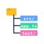

<div align="center">


# QuickCode

**由本地 OpenAI 兼容 LLM 驱动的 Windsurf 风格自主编码 Agent**

在你自己的机器上跑、用你自己的模型、改你自己的代码 —— 一个完全可离线的 VS Code AI 编程助手。

[](https://code.visualstudio.com/)
[](#-许可证)
[](#-为什么选-quickcode)
[](#-支持的后端)
[](#-支持的后端)
[](#-支持的后端)

</div>

---

## 📖 目录

- [✨ 为什么选 QuickCode](#-为什么选-quickcode)
- [🎯 核心特性](#-核心特性)
- [🚀 快速开始](#-快速开始)
- [⚙️ 配置](#️-配置)
- [💬 使用](#-使用)
- [🛠 命令面板](#-命令面板)
- [🧰 内建工具](#-内建工具)
- [🏗 架构总览](#-架构总览)
- [🧪 开发](#-开发)
- [📜 许可证](#-许可证)

---

## ✨ 为什么选 QuickCode

<table>
<tr>
<td width="80" align="center" valign="top"></td>
<td>

**完全本地优先**
代码、提示词、补全结果统统不出本机。只要你的服务暴露 OpenAI 兼容协议（Ollama / LM Studio / vLLM / llama.cpp / TGI / 自建网关），即可对接。

</td>
</tr>
<tr>
<td align="center" valign="top"></td>
<td>

**真正的 Agent 循环**
不是简单的"补全一段就停"。模型自带读文件、搜代码、跑 LSP、提交编辑、问用户等工具，会自己迭代直到任务完成（受 `quickcode.agent.maxIterations` 限制）。

</td>
</tr>
<tr>
<td align="center" valign="top"></td>
<td>

**Git Checkpoint 兜底**
每次 Agent 写盘前自动打一个 `refs/quickcode/checkpoints/<时间戳>` 快照，回滚一键搞定，再大胆的改也不慌。

</td>
</tr>
<tr>
<td align="center" valign="top"></td>
<td>

**后台代码探索器**
IDE 闲置时自动选取一个文件，读懂它，并把摘要、可疑 Bug、自动生成的单元测试写进 `.quickcode/` 目录。等你回到键盘时已经有一份"昨晚发生了什么"报告。

</td>
</tr>
</table>

---

## 🎯 核心特性

###  &nbsp;Hunk 级别的可审阅编辑

Agent 不会偷偷改你的文件。每次修改都通过 `propose_edit` 生成 diff 预览，你可以**逐 hunk 接受 / 拒绝**，也可以一键全收 / 全拒。

- 命令：`QuickCode: Accept Hunk` / `QuickCode: Reject Hunk`
- 命令：`QuickCode: Accept All Pending Suggestions` / `Reject All`

###  &nbsp;深度 LSP 集成

Agent 调用的不是 grep，而是你已装的语言服务器：

| 工具 | 用途 |
|---|---|
| `find_definition` | 跳转到定义（跨 import / re-export） |
| `find_references` / `find_references_by_name` | 查找引用（按位置或仅按名字） |
| `find_implementations` | 找接口 / 抽象方法的实现 |
| `document_symbols` | 文件大纲（先大纲再读源码） |
| `workspace_symbols` | 全工作区按名搜索符号 |
| `hover_info` | 类型 / 签名 / 文档 |
| `get_function_range` | 抓取一个函数的完整代码块 |

支持任何已装的 VS Code 语言扩展：TypeScript、Python、Go、Rust、Java、C/C++、C#、Ruby、PHP、Swift、Scala、Kotlin、Lua、Dart……

###  &nbsp;多端点 / 多模型

在 `quickcode.llm.endpoints` 里登记任意多个 OpenAI 兼容服务，每个端点可以独立设置 `baseURL`、`apiKey`、`contextWindow`、`temperature`、TLS 校验……Chat 面板的模型选择器会按端点分组展示，并支持从 `/v1/models` 在线拉取列表。

###  &nbsp;智能上下文管理

- 自动计算 token 占用，Chat 面板有实时上下文使用率仪表
- 占用 ≥ 90% 时**自动压缩**历史，把工作记忆压回 ≤ 40%
- 模型因输出 token 上限被截断时，可配置 `autoContinueOnLength` 自动续写

###  &nbsp;预热的工作区索引

扩展激活时就一次性走完工作区，构建文件索引和大纲，并嵌入到系统提示中。模型从第一句话起就**知道项目长什么样**，不必每次靠工具反复探路。索引会随 `onDidCreate / onDidDelete / onDidRename` 自动刷新。

###  &nbsp;自动单测生成（可选执行）

后台探索器会针对它"看不准"的逻辑给单文件生成单元测试，写进 `.quickcode/tests/`。开启 `quickcode.background.runGeneratedTests` 后，TS/JS 走 vitest/jest，Python 走 pytest，每个测试的通过 / 失败 / 跳过 / 超时结果都会写进 `verifications.md`。

---

## 🚀 快速开始


### 1. 准备一个本地 LLM 服务

挑一个：

```bash
# Ollama（最省事）
ollama pull qwen2.5-coder:7b
ollama serve            # 默认监听 http://localhost:11434

# LM Studio
# 启动 LM Studio → Local Server → Start Server (默认 http://localhost:1234/v1)

# vLLM
python -m vllm.entrypoints.openai.api_server --model Qwen/Qwen2.5-Coder-7B-Instruct
```

### 2. 安装扩展

从打包好的 vsix：

```powershell
code --install-extension quickcode-0.1.0.vsix
```

或在仓库内自己打包：

```powershell
npm install
npm run package
npm run vsix
```

### 3. 打开侧边栏开始聊

点击活动栏的 ⚡ 图标 → 进入 **QuickCode Chat**。
首次运行如果还没选模型，会引导你打开 `quickcode.llm.*` 设置或运行 `QuickCode: Select Active Model`。

 试一句： **"读 src/extension.ts 然后画一张组件依赖图给我。"**

---

## ⚙️ 配置


打开 VS Code 设置 → 搜 `quickcode`。下面是关键项。

### 🔌 LLM 端点

| 设置项 | 默认值 | 说明 |
|---|---|---|
| `quickcode.llm.baseURL` | `http://localhost:11434/v1` | 单端点快速模式：OpenAI 兼容 base URL |
| `quickcode.llm.apiKey` | `ollama` | API key（多数本地服务忽略） |
| `quickcode.llm.model` | `qwen2.5-coder:7b` | 模型 id |
| `quickcode.llm.contextWindow` | `32768` | 模型总上下文窗口（tokens） |
| `quickcode.llm.temperature` | `0.2` | 采样温度 |
| `quickcode.llm.allowSelfSignedCerts` | `false` | 跳过 TLS 校验（仅自签名内网服务用） |
| `quickcode.llm.endpoints` | `[]` | **推荐**：多端点列表（见下） |
| `quickcode.llm.activeEndpoint` / `activeModel` | — | 当前激活的端点名 + 模型 id（由模型选择器自动写入） |

多端点示例：

```jsonc
"quickcode.llm.endpoints": [
  {
    "name": "本地 Ollama",
    "baseURL": "http://localhost:11434/v1",
    "models": ["qwen2.5-coder:7b", "deepseek-coder-v2:16b"]
  },
  {
    "name": "公司 vLLM",
    "baseURL": "https://llm.intra/v1",
    "apiKey": "${INTRA_KEY}",
    "contextWindow": 65536,
    "allowSelfSignedCerts": true
  }
]
```

### 🤖 Agent 行为

| 设置项 | 默认值 | 说明 |
|---|---|---|
| `quickcode.agent.maxIterations` | `25` | 单次请求内最多工具迭代轮数 |
| `quickcode.agent.requireConfirmBeforeEdit` | `true` | 写盘前是否要求人工确认 |
| `quickcode.agent.autoContinueOnLength` | `true` | 因输出 token 上限被截断时自动续写 |
| `quickcode.agent.maxAutoContinues` | `3` | 连续自动续写上限 |

### 🛡 Git Checkpoint

| 设置项 | 默认值 | 说明 |
|---|---|---|
| `quickcode.git.autoCheckpoint` | `true` | 写盘前快照到 `refs/quickcode/checkpoints/<时间戳>` |

### 🗂 工作区上下文

| 设置项 | 默认值 | 说明 |
|---|---|---|
| `quickcode.context.outlineBaseDepth` | `2` | 嵌入系统提示的工作区大纲递归深度 |
| `quickcode.context.outlineSrcDepth` | `4` | 源代码目录（src/lib/app/packages…）单独深度 |
| `quickcode.context.outlineMaxBytes` | `6000` | 大纲软上限（字符），超出会截断 |
| `quickcode.context.outlineExtraExcludes` | `[]` | 额外排除的目录名 |

### 🌙 后台代码探索器

| 设置项 | 默认值 | 说明 |
|---|---|---|
| `quickcode.background.enabled` | `false` | 总开关 |
| `quickcode.background.idleThresholdMs` | `10000` | 用户停止编辑多久后开始一轮 |
| `quickcode.background.minIntervalMs` | `30000` | 两轮之间最小间隔 |
| `quickcode.background.filesPerCycle` | `1` | 每轮分析文件数 |
| `quickcode.background.maxConcurrentTopics` | `10` | 单轮内并发调查主题数 |
| `quickcode.background.includeExtensions` | `ts,tsx,py,go,rs,…` | 允许的源文件扩展名 |
| `quickcode.background.maxFileBytes` | `120000` | 跳过超过此字节数的文件 |
| `quickcode.background.outputDir` | `.quickcode` | 报告输出目录 |
| `quickcode.background.endpoint` / `model` | `""` | 后台专用端点 / 模型（空 = 继承 Chat） |
| `quickcode.background.runGeneratedTests` | `false` | 自动执行生成的单测 |

> 后台探索器会在用户键入或 Chat 任务运行时自动暂停。

---

## 💬 使用

打开活动栏的 **QuickCode** 视图，输入需求即可。一些用得上的提示：

- **明确文件**：`@src/agent/AgentLoop.ts` 当前不支持 `<...>`，加上吧
- **指定语言**：`用中文回答` / `keep replies in English`
- **暂停 / 继续**：在 Chat 面板底部，长任务可随时取消
- **新会话**：命令 `QuickCode: New Chat`
- **回滚**：`QuickCode: Restore Git Checkpoint`，从快照列表里挑一个时间点
- **后台菜单**：点 Chat 面板右下的状态药丸 → 启用 / 立即跑一轮 / 看活动日志 / 看报告

---

## 🛠 命令面板


| 命令 ID | 标题 |
|---|---|
| `quickcode.newChat` | New Chat |
| `quickcode.configureModel` | Configure Model（打开设置） |
| `quickcode.selectModel` | Select Active Model（按端点选模型，可在线 fetch） |
| `quickcode.restoreCheckpoint` | Restore Git Checkpoint |
| `quickcode.acceptAllSuggestions` / `rejectAllSuggestions` | 全收 / 全拒未决 hunk |
| `quickcode.acceptHunk` / `rejectHunk` | 单个 hunk 接 / 拒 |
| `quickcode.background.toggle` | 启停后台探索器 |
| `quickcode.background.runOnce` | 立即跑一轮后台分析 |
| `quickcode.background.selectModel` | 单独为后台选模型 |
| `quickcode.background.showReport` | 打开 `.quickcode/README.md` |
| `quickcode.background.showActivityLog` | 打开后台 Output 通道 |
| `quickcode.background.resetState` | 清空文件 hash，让所有文件重新分析 |
| `quickcode.background.menu` | 后台菜单（药丸点击的入口） |

---

## 🧰 内建工具

Agent 自动可用的工具，按用途分组：

### 文件 / 工作区
- `read_file` — 读文件指定行段，1-indexed
- `workspace_outline` — 文件树概览，支持子路径与深度
- `list_dir` — 列目录
- `grep_search` — 工作区文本检索

### LSP（前面已列出）
`find_definition` · `find_references` · `find_references_by_name` · `find_implementations` · `document_symbols` · `workspace_symbols` · `hover_info` · `get_function_range`

### 编辑 / 交互
- `propose_edit` — 提交一段 diff，等用户接 / 拒
- `ask_user` — 需求模糊时反问用户

### 计划 / 记忆
- `update_plan` — 复杂任务发布多步计划，状态在 Chat UI 实时可见
- `record_lesson` / `forget_lesson` — 把跨会话的"教训"写进持久记忆

### 语言专用（按需启用）
- `eslint_fix` — 对当前编辑器跑 ESLint --fix
- `dotnet_build` — 编译 .NET 项目
- `avalonia_preview` — 打开 Avalonia XAML 预览

> 完整的 schema 和描述见 [`src/agent/tools/`](src/agent/tools/)。

---

## 🏗 架构总览


```
┌──────────────────────────────────────────────────────────────────┐
│                       extension.ts (激活入口)                     │
└──────┬──────────────┬───────────────┬──────────────┬─────────────┘
       │              │               │              │
       ▼              ▼               ▼              ▼
 ┌──────────┐  ┌────────────┐  ┌────────────┐  ┌─────────────┐
 │ ChatView │  │ AgentLoop  │  │ HunkApplier│  │ Background  │
 │ Provider │◄─┤ (工具循环) ├──┤ + DiffPrev │  │ Explorer    │
 │ (Webview)│  └─────┬──────┘  └─────┬──────┘  └──────┬──────┘
 └─────┬────┘        │               │                │
       │             │  调用工具      │  Git 快照       │ 闲置时跑
       │             ▼               ▼                ▼
       │      ┌───────────┐  ┌──────────────┐  ┌──────────────┐
       │      │ tools/*.ts│  │ GitCheckpoint│  │ TestRunner   │
       │      │  + LSP    │  └──────────────┘  └──────────────┘
       │      └───────────┘
       ▼
 ┌──────────────────────────────────────────────────────┐
 │ OpenAIClient → 任意 OpenAI 兼容 endpoint              │
 │ (Ollama / LM Studio / vLLM / llama.cpp / 自建网关)    │
 └──────────────────────────────────────────────────────┘

  支撑模块: WorkspaceIndex · WorkspaceOutline · Compressor
            tokenizer (gpt-tokenizer) · LspBridge · DependencyGuard
```

源码目录：

| 目录 | 内容 |
|---|---|
| [`src/agent/`](src/agent) | Agent 主循环、提示词、工具实现 |
| [`src/background/`](src/background) | 后台代码探索器、单测执行 |
| [`src/chat/`](src/chat) | Webview Chat 视图、会话存储 |
| [`src/context/`](src/context) | 工作区索引、大纲、上下文压缩 |
| [`src/edits/`](src/edits) | Diff 预览、Hunk 应用器 |
| [`src/git/`](src/git) | Git checkpoint 实现 |
| [`src/llm/`](src/llm) | OpenAI 兼容客户端 + tokenizer |
| [`src/lsp/`](src/lsp) | 对 vscode LSP 的桥接 |
| [`src/memory/`](src/memory) | 跨会话教训持久化 |
| [`src/deps/`](src/deps) | 依赖（VS Code 扩展）守护 |

### 🌐 支持的后端

只要它说 OpenAI 协议（`/v1/chat/completions`、`/v1/models` 即可）：

- ✅ **Ollama** — 默认配置开箱即用
- ✅ **LM Studio** — Local Server 模式
- ✅ **vLLM** — `--api-server openai`
- ✅ **llama.cpp / llama-server**
- ✅ **Text Generation Inference (TGI)** OpenAI 适配
- ✅ **OpenRouter / 自建网关 / Azure OpenAI**

---

## 🧪 开发

```powershell
# 拉依赖
npm install

# 增量编译（监听）
npm run watch

# 在 VS Code 里按 F5 启动 Extension Host

# 生产构建
npm run package

# 打 vsix
npm run vsix
```

技术栈：

- **TypeScript 5** + **esbuild**（单文件打包到 `dist/extension.js`）
- **openai** SDK（指向任意兼容 endpoint）
- **gpt-tokenizer**（本地 token 计算 / 上下文用量仪表）
- **diff** （hunk 解析）
- VS Code API ≥ 1.85

调试：

- `.vscode/launch.json` 已配好 `Run Extension`
- 后台探索器有自己的 Output 通道：`QuickCode Background`
- 主日志在 `QuickCode` Output 通道

---

## 📜 许可证


MIT License — 自由使用、修改、闭源分发，但保留版权声明。详见 [`LICENSE`](LICENSE)（如未附带，本仓库默认按 MIT 释出）。

---

<div align="center">

**让模型留在你的机器里 · 让代码留在你的仓库里**

如果你觉得 QuickCode 有用，欢迎 ⭐ Star，提 Issue，发 PR。

</div>
